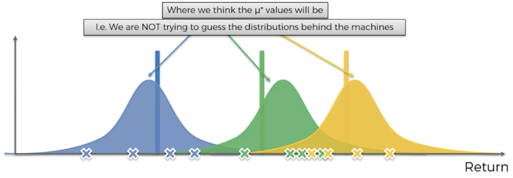

# Aim

- Implementation of several multi-armed bandits' (MABs) algorithms. Currently, only Thompson Sampling is supported.
- Simple experiment regarding the use the **Thompson Sampling (TS)** algorithm

# Thompson Sampling
## Brief overview

- The TS algorithm builds a distribution of where the expected value of a arm (slot machine) might lie
    
    
    
- This method can only be used for binary outcomes (click add or not click, for example)
- There is a generalization, though, **Gaussian Thompson Sampling**, which takes in to account multiple outcomes (not implemented yet)

## Experiment

The experiment consist in using the TS algorithm in a batch setting. That is, the experiment assumes that the impacts of the actions taken today will only be known in the following day.

**Note**: The experiment was implemented using the `pandas` library, but we wish to adapt it to `pyspark`.

### Setting

Let us assume we have $10$ arms (we can see them as ads), each of them with a certain probability of being clicked. Since this is a simulation, we know the probabilities, but in reality they are unkown.

We also have a fixed population of $100\space 000$ clients to which we are going to show the ads. We are using a fixed population for simplicity, but this population can change throught the days (clients come and go).

Our goal is to use the TS algorithm to optimize our choice of ads. That is, we want to choose the ad that generates the most clicks (the highest CTR).

### Simulation

Since the experiment assumes that we only known the outcomes of the actions taken in the next day, we have a cold start situation. Thus, to begin,

- In day $0$ we send a batch with all the clients and ads they will be shown (uniformly at random) for day $1$;
- In day $1$ the ads that we have specified in day $0$ are being shown to the clients, so we still don't have historic data with the outcomes (click/no click). Hence, we send a batch with all the clients and ads they will be shown (uniformly at random) for day $2$;
- In day $2$ we send a batch with all the clients and ads they will be shown for day $3$, but now taking into account the history of clicks they've made in day $1$

Note that we need to send a batch with all the clients and the respective ads they will be shown in case they access the website/email/etc. Since we are in a batch setting, we cannot invoke an API and retrieve the ad for a certain user. We need to provide all the ad each client will be shown (they might not see it, but we still need to have that information)

The ouput each day is a DataFrame with the following structure

```
client_id	arm_id	      date
	0	      4	       2023-03-31
	1	      8	       2023-03-31
	2	      6	       2023-03-31
	3	      3	       2023-03-31
	4	      9	       2023-03-31
```

where `client_id` is the ID of the client (an integer between $0$ and $99_999$), `arm_id` is the ID of the ad (an integer between $0$ and $9$) and `date` represents the date in which the clients should se their respective ad in case they access the website/email/etc. In the example DataFrame, it corresponds to an attribution of ads to clients made in the day `2023-03-30`, with information until `2023-03-29`, that has effect on the `2023-03-31`.

The ads that will be shown to each client are computed using the TS algorithm based on the clicks made by the clients.

For a particular run, the following results were obtained

    

From the plot above, we can see that the ad 9 (which is the one with the highest probability of being clicked) is the most shown ad.
